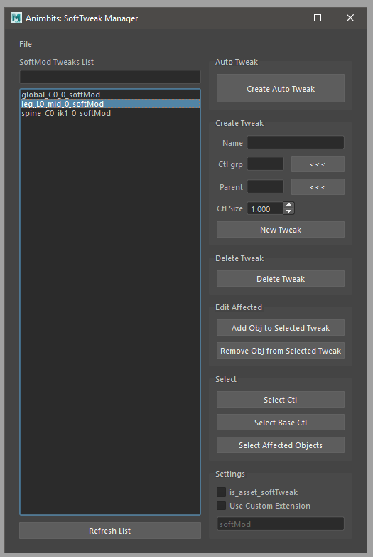

Animbits User Documentation
###########################

Tools for animators.

.. image:: images/animbits/animbits_menu.png
    :align: center
    :scale: 95%

Soft Tweaks
===========

This tool create and manage SoftTweaks (ST for short) and also provide as simple API to import and export configurations, so is possible to integrate with your pipeline and animation publishing system.

.. image:: images/animbits/gifs/softtweak.gif
    :align: center

SoftTweak is a dynamic position tweak using softmod deformer
The credit of the idea goes to `Vasil Shotarov <http://bindpose.com/help-animators-fix-intersections-softmod-deformer/>`_ , thanks!

The SoftTweak have 2 controls. The Base represents the bind position where the ST will not have any effect. The main control will trigger the deformation when is not in the reset position..

.. image:: images/animbits/softtweak_ctl.png
    :align: center
    :scale: 95%

In the ST main control we can find a falloff channel to control the area of deformation

.. image:: images/animbits/softtweak_falloff.png
    :align: center
    :scale: 95%

SoftTweak Manager GUI
---------------------

By default the SoftTweak is design to be used by shot and not part of a rig. However if is needed to publish a rig with some SoftTweaks there is an option to flag (is_asset_softTweak) the SoftTweak as asset tweak. So the tool will make a distinction between the ones that need to be publish with the shot and the ones that are included in the asset.

**File Menu:**

* **Export Selected:** Exports selected ST from the list
* **Export All:** Exports all the ST from the list. If search filter is used, will not affect the export. But export will make a distinction between regular SoftTweak and  asset SoftTweak
* **Import:** Import ST configuration from a file.

**GUI:**

* **Search Filter:** (1) Quick search filter of the SoftTweak list.
* **SoftTweaks List:** (2) ST selection list.
* **Create Auto Tweak:** Create a tweak based on the current selection.

	1. Select the objects to apply the ST
	2. Last element selected should be a control. This will be the parent of the ST. Also the ST will take the Name and the group(set) from the parent
	3. Click Crete Auto Tweak

* **Name:** Name of the new ST.
* **Ctl grp:** Group of controls to add the new ST controls.
* **Parent:** Parent of the new ST.
* **Ctl Size:** Parent of the new ST.
* **New Tweak:** Create a new ST.
* **Delete Tweak:** Delete the tweaks selected in the ST list.
* **Add Object to Selected Tweak:** Add selected objects to the tweaks selected in the ST list.
* **Remove Object from Selected Tweak:** Remove selected objects from the tweaks selected in the ST list.
* **Select Ctl:** Select the control from the tweaks selected in the ST list.
* **Select Base Ctl:** Select the Base control from the tweaks selected in the ST list.
* **Select Affected Objects:** Select the object affected by the the tweaks selected in the ST list.
* **is_asset_softTweak:** Tag the new created ST as an asset ST. This will also change the ST selection list to show the asset ST.
* **Use Custom Extension:** The new ST will have a custom suffix.
* **Suffix Name:** (3) Suffix name for the new ST.

API
-----

.. code-block:: python

	# To import a softTweak configuration from script editor or Shifter Custom Step:

	from mgear.animbits import softTweaks as st
	st.importConfigurationFromFile(filePath= path to the .smt configuration file)

	# to export configuration
	# list the softtweaks in the scene
	softtweaks = st._listSoftModTweaks(is_asset=False)
	# export
	st.exportConfiguration(softtweaks)

Smart reset Attribute/SRT
=========================

This command will reset the SRT (Scale, rotation and Translation of any selected object). If an attribute is higlighted in the Channel Box, will reset the channel instead.

**TIP:** Set a hotkey for this command using mGear Hotkey creator in utilities menu.

.. image:: images/animbits/smartReset_hotkey.png
    :align: center
    :scale: 95%

